# 实验一
### 实验目的
- 配置无人值守安装iso并在virtualbox中自动完成
- virtualbox安装完Ubuntu之后新添加的网卡实现自动启动和自动获取IP
- 实现虚拟机和宿主机之间传输文件

### 实验环境
- 虚拟机
    - ```linux ubuntu18.04-1-server```
    - 网络环境
        - 网络地址转换(NAT)
        - host-only
- 宿主机：```windows10```

### 实验步骤

#### 配置无人值守安装的iso并在virtualbox中完成自动安装

##### 1.配置实现ssh远程登录
- 人工值守安装```ubuntu18.04-1-server```虚拟机,安装完成后为虚拟机设置```host-only```网卡
    - 打开配置文件
        ```
        vim /etc/netplan/01-netcfg.yaml
        ```
    - 修改配置如下<br>
        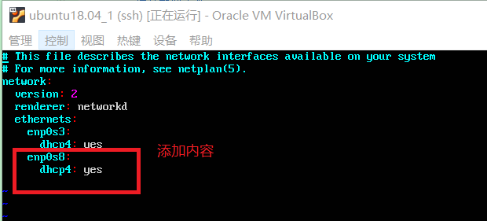
    - 应用
        ```
        sudo netplan apply
        ```
        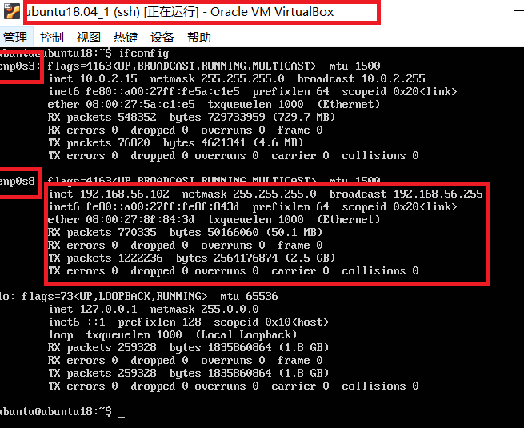

- 配置ssh远程登录
  由于在安装ubuntu虚拟机时已经勾选下载安装```Open SSH```,此处加以验证
  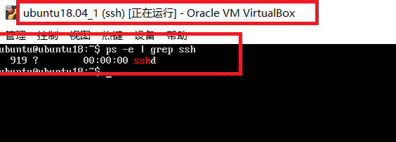
    - 使用```putty```
        - 在宿主机中下载安装putty(```putty-64bit-0.70-installer```)
        - 填入虚拟机中与宿主机同一网段的IP地址
            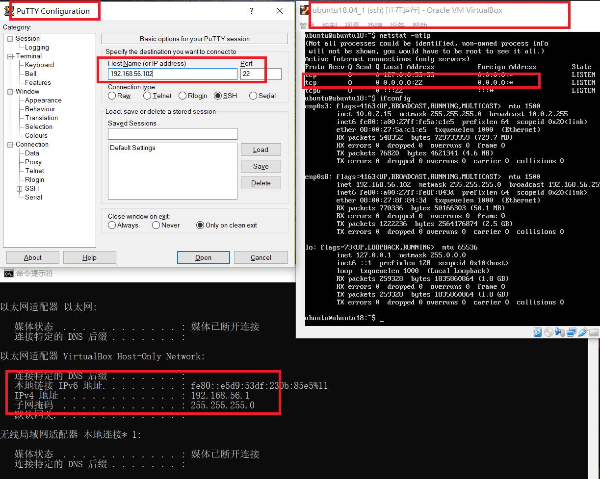
        - 设置免密登录
            - 使用```puTTYgen```生成公私钥对,将私钥保存在本机
                
            - 在虚拟机的```home```目录下创建```.ssh```目录,在该目录下创建```authorized_keys```配置文件
                ```
                mkdir ~/.ssh
                chmod 700 ~/.ssh
                vim ~/.ssh/authorized_keys
                ```
                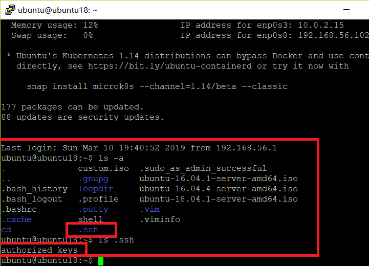
            - 将生成的公钥复制到```authorized_keys```中
                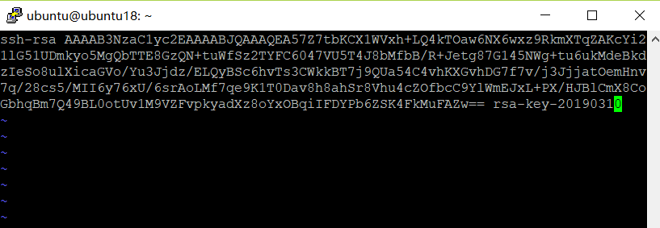
            - 结果展示(免密登录)
                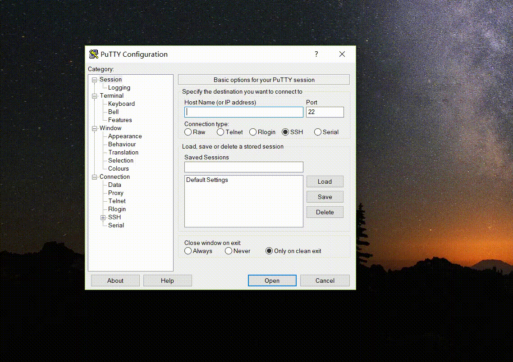
    - 使用```Chocolatey```
        - windows10管理员权限运行cmd,输入如下指令安装Chocolatey
            ```
            @"%SystemRoot%\System32\WindowsPowerShell\v1.0\powershell.exe" -NoProfile -InputFormat None -ExecutionPolicy Bypass -Command "iex ((New-Object System.Net.WebClient).DownloadString('https://chocolatey.org/install.ps1'))" && SET "PATH=%PATH%;%ALLUSERSPROFILE%\chocolatey\bin"
            ```

        - 安装SSH,生成公私钥对
            ```
            choco install openssh
            ssh-keygen -t rsa
            ```
            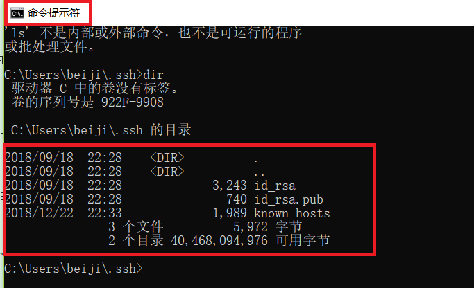

            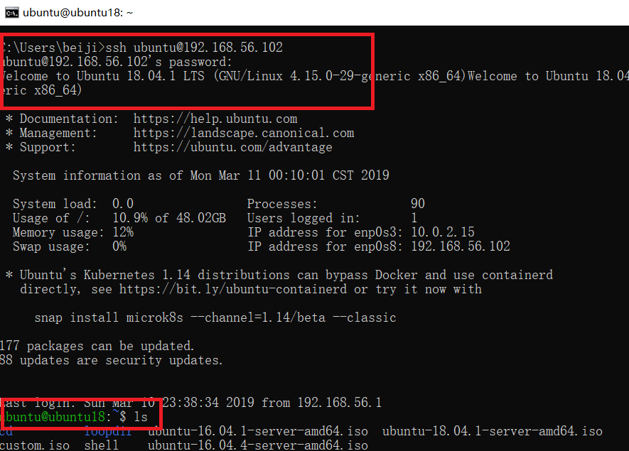

        - 免密登录
            - 将生成的公钥复制入虚拟机```~/.ssh/authorized_keys```
            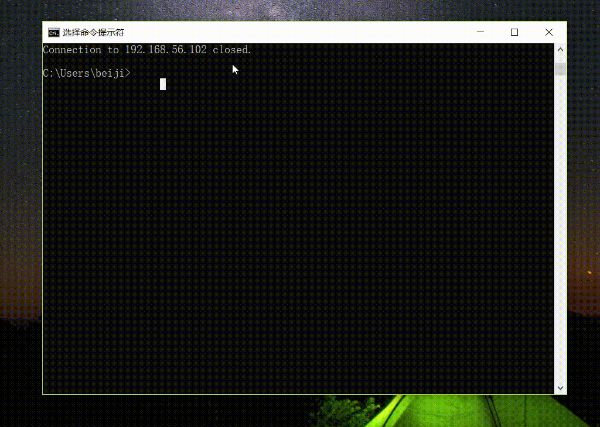

- 创建iso镜像文件
    - 在当前用户目录，非root权限下
        ```
        # 在当前用户目录下创建一个用于挂载iso镜像文件的目录
        mkdir loopdir
        
        # 下载原ubuntu-16.04.1-server-amd64.iso
        wget http://sec.cuc.edu.cn/ftp/iso/ubuntu-16.04.1-server-amd64.iso
        
        # 挂载iso镜像文件到上述创建的loopdir目录中
        sudo mount -o loop ubuntu-16.04.1-server-amd64.iso loopdir
        
        # 创建一个工作目录用于克隆光盘内容
        mkdir cd
        
        # 同步光盘内容到目标工作目录
        rsync -av loopdir/ cd
        
        # 卸载iso镜像
        sudo umount loopdir
        
        ```

    - 进入```cd```工作目录下
        ```
        # 切换目录
        cd ~/cd
        # 打开文件
        vim isolinux/txt.cfg
        
        # 在 isolinux/txt.cfg 文件开头中添加如下内容并保存
        label autoinstall
        menu label ^Auto Install Ubuntu Server
        kernel /install/vmlinuz
        append  file=/cdrom/preseed/ubuntu-server-autoinstall.seed debian-installer/locale=en_US console-setup/layoutcode=us keyboard-configuration/layoutcode=us console-setup/ask_detect=false localechooser/translation/warn-light=true localechooser/translation/warn-severe=true initrd=/install/initrd.gz root=/dev/ram rw quiet
        ```

        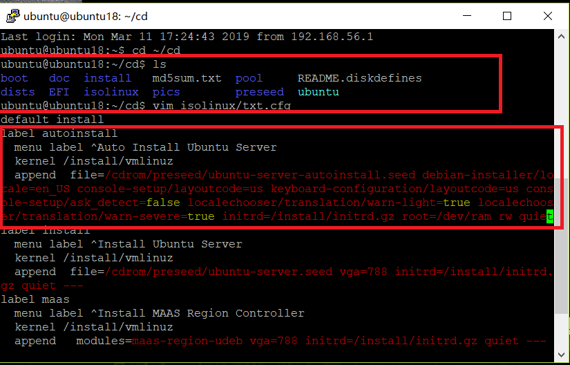

    - 下载配置完成的```ubuntu-server-autoinstall.seed```至```~/cd/preseed```

    - 修改```isolinux/isolinux.cfg```,添加内容```timeout 10```

        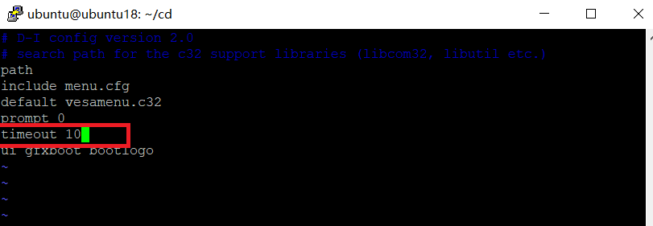

    - 利用shell脚本，生成目标定制iso
        ```
        # 重新生成md5sum.txt
        cd ~/cd && find . -type f -print0 | xargs -0 md5sum > md5sum.txt
        
        # 封闭改动后的目录到.iso，创建shell文件，将以下内容写入shell文件中
        IMAGE=custom.iso
        # 非root权限下运行脚本会显示权限不足
        # BUILD=~/cd/
        BUILD=/home/ubuntu/cd/
        
        mkisofs -r -V "Custom Ubuntu Install CD" \
                    -cache-inodes \
                    -J -l -b isolinux/isolinux.bin \
                    -c isolinux/boot.cat -no-emul-boot \
                    -boot-load-size 4 -boot-info-table \
                    -o $IMAGE $BUILD
        ```
        - 运行脚本，```bash shell```
            - 执行上述指令之前，需要安装mkisofs

    - 将镜像下载至宿主机
        打开宿主机```windows10的cmd```输入如下指令
        ```
        pscp ubuntu@192.168.56.102:/home/ubuntu/custom.iso E:iso
        ```

    - 无人值守下安装结果
     [无人值守安装ubuntu16.04.1](https://www.bilibili.com/video/av46015154/)

- 通过[文本对比工具](https://www.diffchecker.com/diff)对比定制的```ubuntu-server-autoinstall.seed```与官网上给出的不同

    - 选择地区，跳过语言选择

        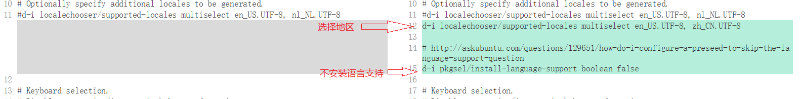

    - 检测链接超时，dhcp，网络配置设置

      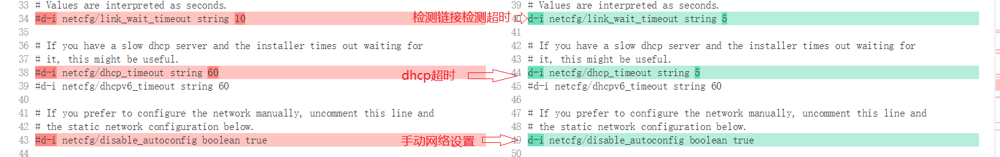

    - 配置静态网络
      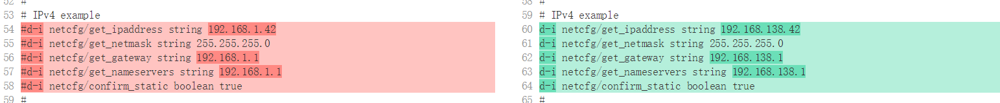

    - 设置主机名，域名，强制使用设定的主机名
      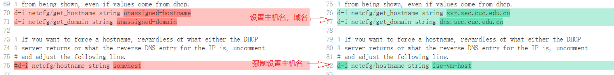

    - 设置用户名和密码
      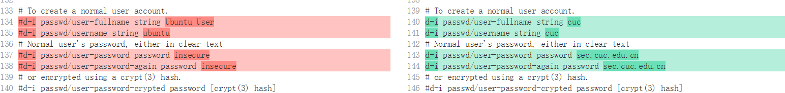
    - 设置时区
      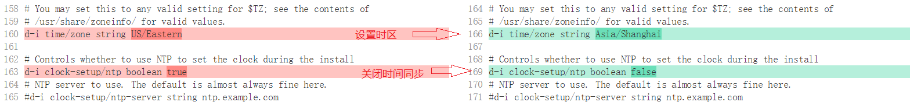
    - 选取最大空闲分区
      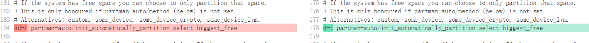
    - LVM分区选择最大卷组,修改预定义分区分配方式
      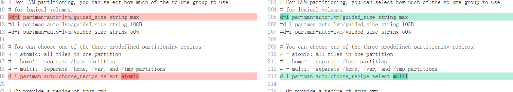
    - 禁用网络镜像
      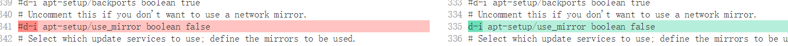
    - 选择安装server版，安装openssh-server,关闭自动更新，安装安全更新
      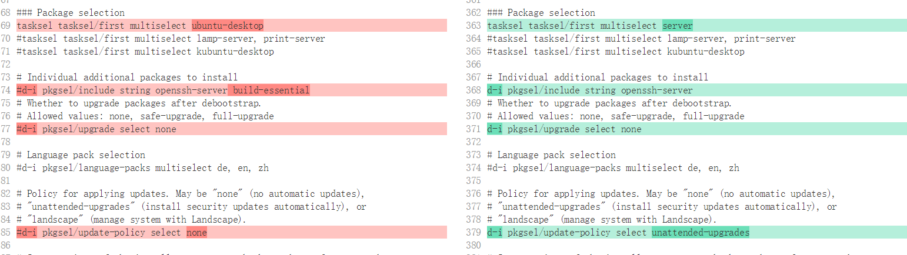

### 参考资料
- [authorized_keys](https://www.ssh.com/ssh/authorized_keys/#sec-Tectia-SSH-code-authorized_keys-code-File)
- [chap0x01.exp.md.html](http://sec.cuc.edu.cn/huangwei/course/LinuxSysAdmin/chap0x01.exp.md.html#/6/3)
- [windows_putty](https://www.ssh.com/ssh/putty/windows/)
- [putty-manuals](https://www.ssh.com/ssh/putty/putty-manuals/0.68/Chapter5.html)
- [bash-home-user-ssh-authorized-keys-no-such-file-or-directory](https://askubuntu.com/questions/466549/bash-home-user-ssh-authorized-keys-no-such-file-or-directory)
- [ubuntu_installation-guide](https://help.ubuntu.com/lts/installation-guide/s390x/apbs04.html)


