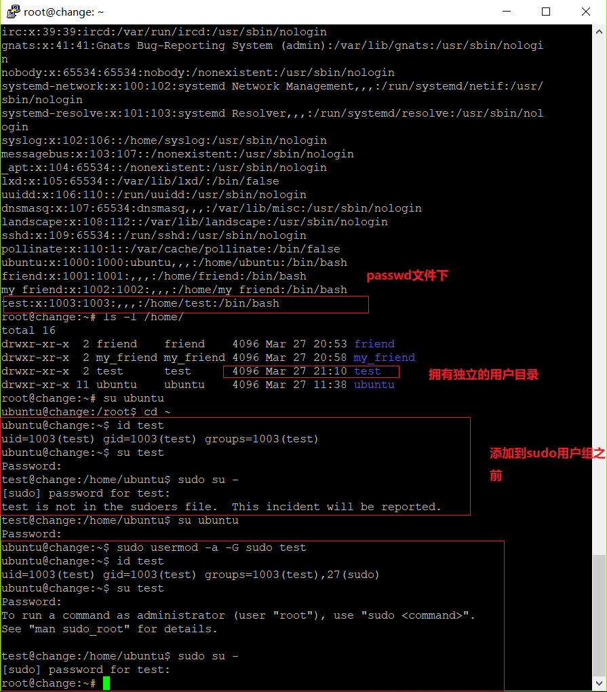
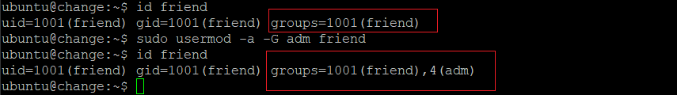
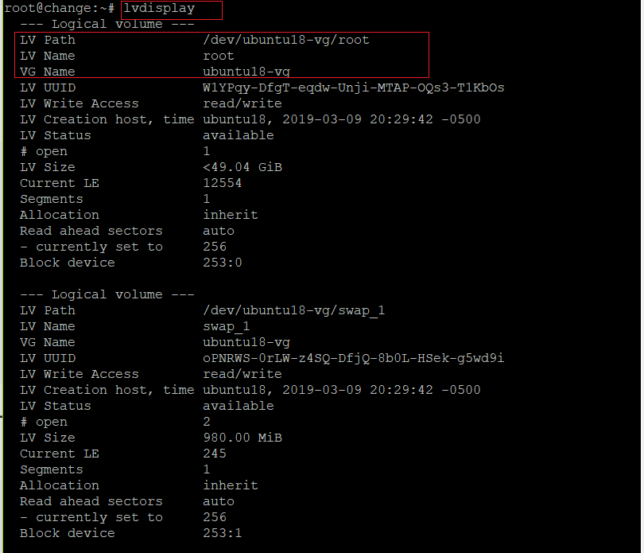
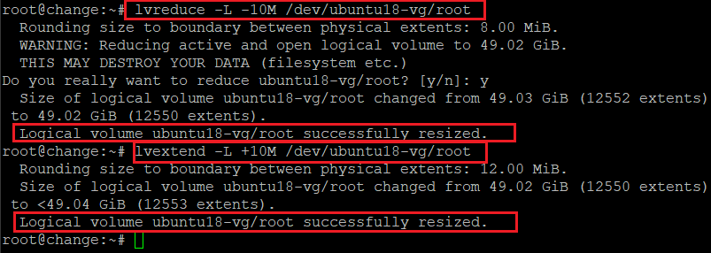
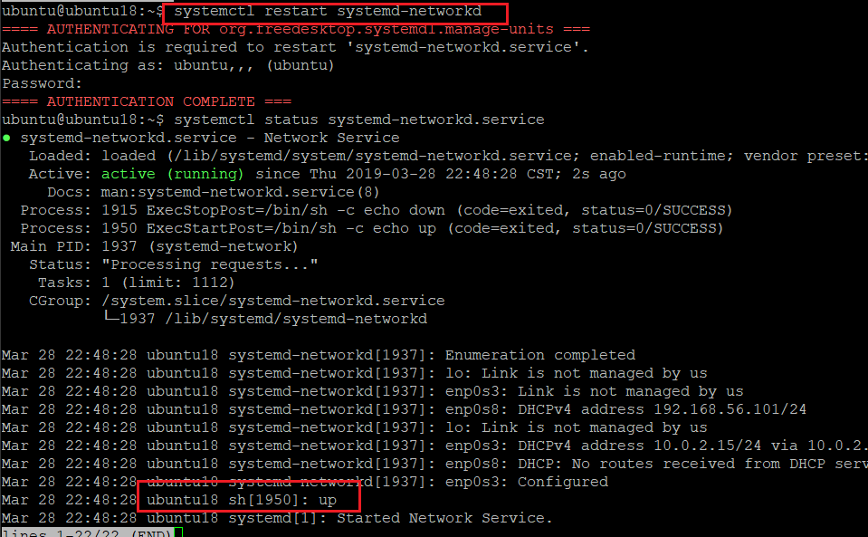
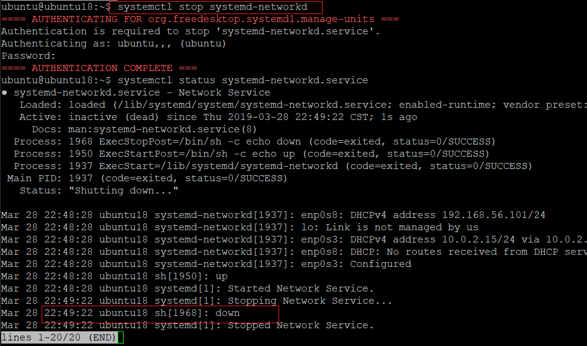
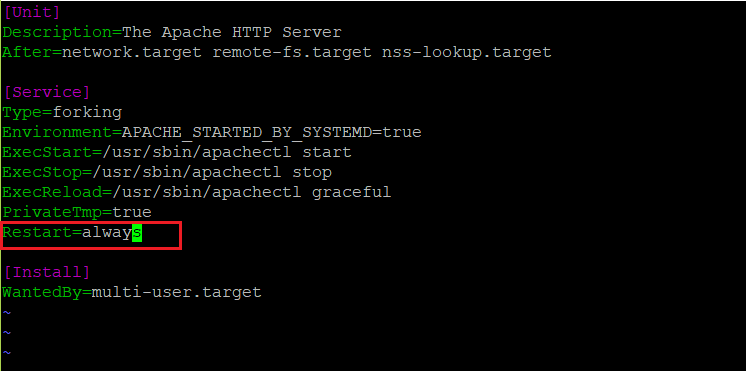
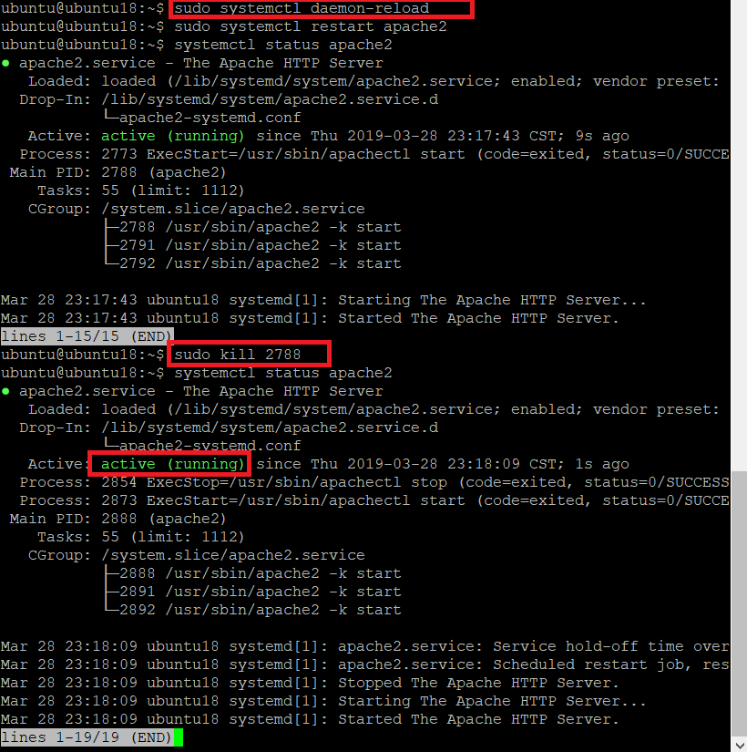

## Systemd入门

##### 实验环境

- ubuntu18.04

##### 实验工具

- putty
- Systemd

### 命令篇

- ##### 系统管理

  [](https://asciinema.org/a/yhQOsY6u85mrNAn4iR0ipZRBr)

  - 遇到的问题

    - 设置时间时，报错：```Failed to set time: Automatic time synchronization is enabled```

      使用```timedatectl set-ntp 0```关闭```set-ntp server```

- ##### Unit

  [](https://asciinema.org/a/Ej5ISbms3dh4gpylwElGfSrba)

- ##### Unit 配置文件

  [](https://asciinema.org/a/LN1Lvefv8rRkMyJ4mqzf3xwId)

- ##### Target

  [](https://asciinema.org/a/BB2arVAsOgMjFe8ZunWetc4ok)

- ##### 日志管理

  [](https://asciinema.org/a/JSonV7IBR5TNfoSsLAwg6gqC5)


## 自查清单

- 如何添加一个用户并使其具有sudo执行程序的权限

  ```
  # 切换到root用户
  sudo su -
  # 添加test用户
  adduser test
  # 将test用户添加到sudo用户组[需要在有sudo权限的用户下操作]
  sudo usermod -a -G sudo test
  ```

  

- 如何将一个用户添加到一个用户组

  ```
  sudo usermod -a -G adm friend
  ```

  

- 如何查看当前系统的分区表和文件系统的详细信息

  - 查看当前系统分区表:```sudo fdisk -l```
  - 文件系统详细详细:```df -a```

- 如何实现开机自动挂载Virtualbox的共享目录分区?

  - 安装增强功能

    ```
    apt-get install build-essential module-assistant
    # 挂载cdrom
    sudo mount /dev/cdrom /mnt/
    # 执行安装命令
    sudo /mnt/VBoxLinuxAdditions.run
    # 重启
    sudo shutdown -r now
    ```

  - systemd设置开机自动挂载

    ```
    # 创建共享文件夹
    mkdir /mnt/shared
    
    # 创建 /etc/systemd/system/mnt-shared.mount
    vi /etc/systemd/system/shared.mount
    [Unit]
      Description=Shared folder
    
    [Mount]
      What=share
      Where=/mnt/shared
      Type=vboxsf
      Options=defaults
    ############################################################  
    
    # 创建 /etc/systemd/system/mnt-shared.automount
    [Unit]
       Description=Shared folder
    
    [Automount]
       Where=/mnt/shared
    
    [Install]
       WantedBy=multi-user.target
    ############################################################
    #  重载
    systemctl daemon-reload
    # 重启
    sudo reboot
    
    ```

    出现的问题：

    - 开始的时候，一直显示不成功，然后查看日志文件,对应的查看mount,发现手残在what后面加了空格，但是删掉以后还是依然报错(分析可能是另一些不可打印字符的存在？或者写的过程中切换到了中文)

      
     - 重写后成功(感谢jackcily同学重写代码及过程支持)

  - 设置开机自动挂载**[失败]**

    ```
    # 创建共享文件夹
    mkdir ~/shared
    # 挂载
    sudo mount -t vboxsf my_share ~/shared
    
    # 修改 /etc/fstab
    sudo vi /etc/fstab
    
    # 添加如下内容
    shared	/home/ubuntu/shared	vboxsf	defaults	0	0
    # 修改 /etc/modules
    vboxsf
    ```

- 基于LVM(逻辑分卷管理)的分区如何实现动态扩容和缩减容量？

  ```
  # 逻辑卷信息
  lvdisplay
  # 扩容
  lvextend -L +10M /dev/ubuntu18-vg/root
  # 缩容
  lvreduce -L +10M /dev/ubuntu18-vg/root
  ```

  

  

- 如何通过systemd设置实现在网络连通时运行一个指定脚本，在网络断开时运行另一个脚本

  ```
  # 对配置文件/lib/systemd/system/systemd-networkd.service进行更改
  
  # 在service段添加ExecStartPost,ExecStopPost
  ExecStartPost=/bin/sh -c "echo up"
  ExecStopPost=/bin/sh -c "echo down"
  
  # 重载
  systemctl daemon-reload
  ```

  

  

- 如何通过systemd设置实现一个脚本在任何情况下被杀死后立刻重启

  设置相关脚本配置文件中```Restart = always```

  

  


### 参考资料


- [pvcreate error : Can’t open /dev/sdx exclusively. Mounted filesystem?By ](<https://www.thegeekdiary.com/lvm-error-cant-open-devsdx-exclusively-mounted-filesystem/> )

- [auto-mounting-network-file-systems-with-systemd](https://blog.agchapman.com/auto-mounting-network-file-systems-with-systemd/)

- [mount.8.html](http://man7.org/linux/man-pages/man8/mount.8.html)

- [how-to-fix-virtualbox-startup-error-vboxadd-service-failed](https://superuser.com/questions/298367/how-to-fix-virtualbox-startup-error-vboxadd-service-failed)

- [mount-a-volume-using-systemd-1h2f](https://dev.to/adarshkkumar/mount-a-volume-using-systemd-1h2f)

- [fsck-error-on-boot-dev-sda6-unexpected-inconsistency-run-fsck-manually](https://askubuntu.com/questions/697190/fsck-error-on-boot-dev-sda6-unexpected-inconsistency-run-fsck-manually)

- [jackcily](<https://github.com/CUCCS/linux-2019-jackcily/blob/e62fef85f60869267e39f2d315611fb166a550f7/job3/job3.md>)

